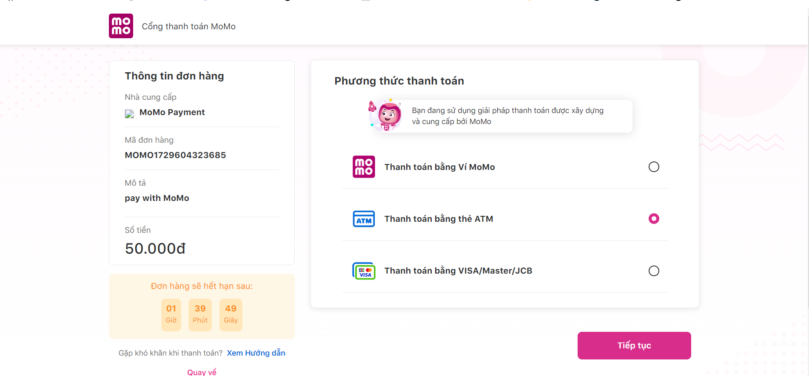

Thông Tin Test Thẻ ATM
Sử dụng Thử Nghiệm Thanh Toán ATM để hiểu cách hoạt động trên Momo.

Bước 1: Chọn thanh toán bằng thẻ ATM

Bước 2: Sử dụng tài khoản test để thanh toán thử.
| No | Tên Số thẻ | Hạn ghi trên thẻ | Ngày tạo thẻ | OTP | Trường hợp test |
|---| ------------ | ------------------- | ------ | ----- | ----------------------- |
| 1 | NGUYEN VAN A | 9704 0000 0000 0018 | 03/07 | OTP | Thành công |
| 2 | NGUYEN VAN A | 9704 0000 0000 0026 | 03/07 | OTP | Thẻ bị khóa |
| 3 | NGUYEN VAN A | 9704 0000 0000 0034 | 03/07 | OTP | Nguồn tiền không đủ |
| 4 | NGUYEN VAN A | 9704 0000 0000 0042 | 03/07 | OTP | Hạn mức thẻ |
